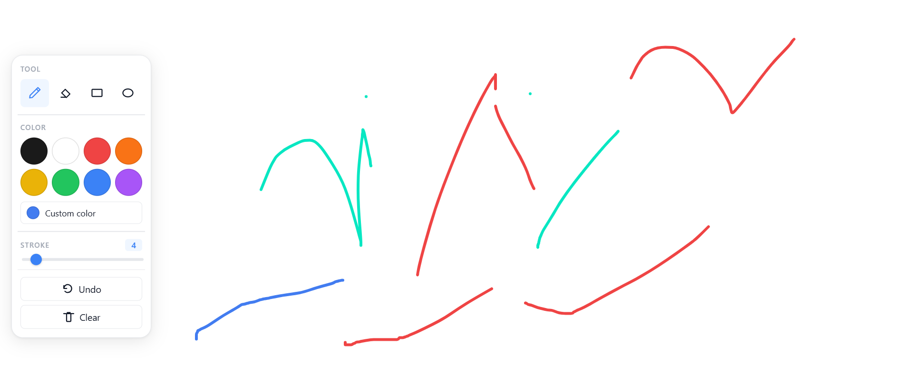
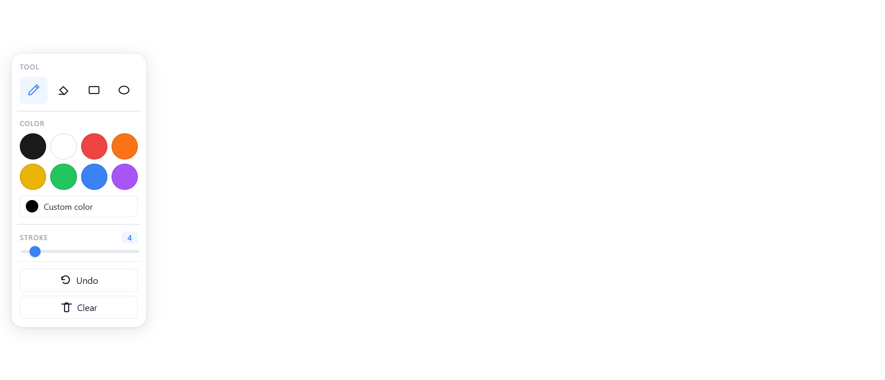

# Whiteboard — Tablica do Rysowania w Czasie Rzeczywistym

**Wielodostępna tablica, na której każda kreska, kształt i kursor synchronizują się na żywo we wszystkich otwartych kartach — zbudowana na Angular signals i Socket.io.**

**Strona na żywo:** [whiteboard-workspace.netlify.app](https://whiteboard-workspace.netlify.app)
**GitHub:** [github.com/Stasiek99/whiteboard](https://github.com/Stasiek99/whiteboard)

[🇬🇧 English](README.md) | 🇵🇱 Polski

---

## Czym jest ten projekt

Tablica do wspólnego rysowania w czasie rzeczywistym, zbudowana jako monorepo npm — frontend Angular 21 (komponenty standalone, signals, natywne Canvas API) połączony z backendem Node.js/Express + Socket.io. Każdy użytkownik podłączony do tablicy rysuje na wspólnym płótnie, widzi kursory pozostałych osób podpisane i poruszające się na żywo, a dołączając w trakcie sesji od razu widzi w pełni odtworzoną tablicę ze stanu serwera.

---

## Zrzuty ekranu

### Płótno — rysowanie odręczne, kształty i kolor

### Panel narzędzi — narzędzia, paleta kolorów i grubość kreski

---

## Funkcjonalności

### Silnik rysowania
- **Pędzel odręczny** — płynne kreski renderowane w pętli `requestAnimationFrame`, przerysowywane tylko wtedy, gdy tablica faktycznie się zmieniła
- **Gumka, prostokąt i elipsa** — podgląd kształtu rysowany na przezroczystym płótnie nakładki, zatwierdzany po puszczeniu wskaźnika
- **Wybór koloru i grubości kreski** — gotowe swatche plus pole na własny kolor i suwak grubości na żywo
- **Cofnij i wyczyść tablicę**
- **Renderowanie świadome DPI** — płótno skalowane pod `devicePixelRatio`, dzięki czemu kreski trafiają dokładnie pod kursor na ekranach retina
- **Znormalizowany układ współrzędnych** — każdy punkt zapisywany jest jako float 0.0–1.0 względem rozmiaru płótna, a nie w surowych pikselach, więc rysunki nie „rozjeżdżają się” przy zmianie rozmiaru okna czy ekranu

### Współpraca w czasie rzeczywistym
- **Synchronizacja na żywo przez Socket.io** — kreski, kształty, wymazania i czyszczenie tablicy trafiają do wszystkich klientów w pokoju natychmiast po puszczeniu wskaźnika
- **Odtworzenie stanu tablicy** — klient dołączający w trakcie sesji najpierw otrzymuje pełny log akcji, dzięki czemu widzi dokładnie tę samą tablicę co pozostali
- **Automatyczne ponowne połączenie** — po utracie połączenia klient sam dołącza ponownie do tablicy i synchronizuje stan po powrocie sieci
- **Ograniczona pamięć serwera** — log akcji każdego pokoju ma limit, a nieaktywne pokoje są czyszczone po 30 minutach bezczynności

### Nakładka wielu kursorów
- **Podpisane kursory zdalne** — każdy podłączony użytkownik ma nazwany, kolorowy kursor renderowany na żywo nad płótnem
- **Losowo generowana tożsamość** — przymiotnik + rzeczownik + numer, zapisywane per sesja karty, więc odświeżenie strony nie tworzy nowego użytkownika
- **Zanikanie przy bezczynności** — kursor, który przestaje się poruszać na kilka sekund, płynnie się ukrywa zamiast zaśmiecać tablicę
- **Ograniczony strumień kursora** — pozycja kursora jest throttlowana przed wysłaniem przez socket, co utrzymuje niskie zużycie pasma i CPU nawet przy kilku aktywnych użytkownikach

### Infrastruktura
- **Angular 21** — komponenty standalone, stan oparty o signals, obsługa wskaźnika poza strefą zone.js dla płynnej interakcji przy intensywnym rysowaniu
- **Testy E2E** — Playwright, obejmujące synchronizację rysowania między kartami, widoczność kursorów i zachowanie przy ponownym połączeniu
- **Testy jednostkowe** — Vitest zarówno po stronie klienta Angular, jak i serwera Node.js
- **CI/CD** — frontend na Netlify, serwer WebSocket na Railway, konfiguracja adresu socketu zależna od środowiska

---

## Stack technologiczny

| Warstwa | Technologia |
|---|---|
| Frontend | Angular 21 (standalone, signals) |
| Renderowanie | Natywne Canvas API + `requestAnimationFrame` |
| Realtime | Socket.io (klient i serwer) |
| Backend | Node.js + Express |
| Język | TypeScript |
| Stan reaktywny | RxJS 7.8 |
| Testy jednostkowe | Vitest |
| Testy E2E | Playwright |
| Hosting frontendowy | Netlify |
| Hosting backendowy | Railway |
| Monorepo | npm workspaces |
